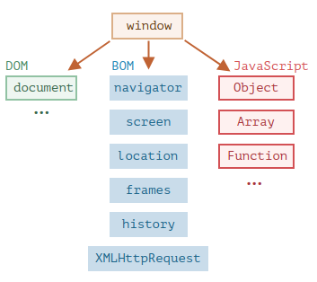
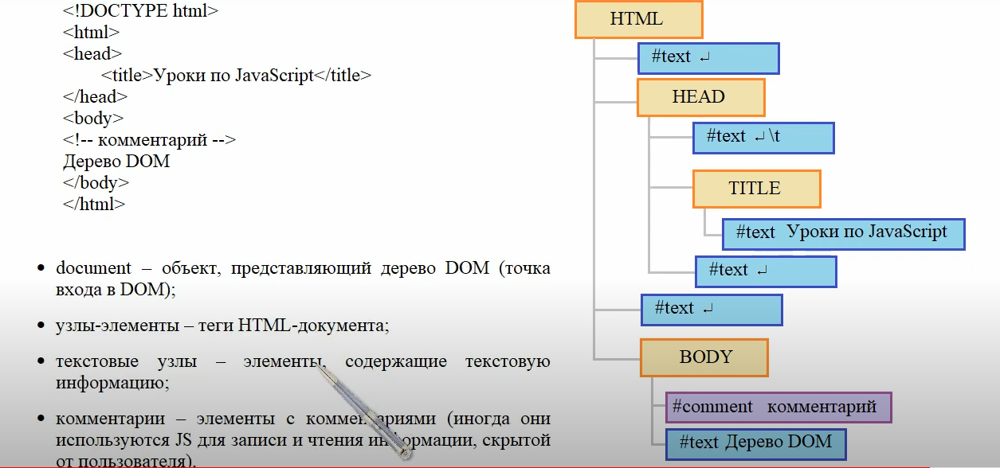

# Введение в DOM
<br>  

## Браузерное окружение, спецификации
Сегодня `JavaScript` может использоваться в браузере, на веб-сервере или в какой-то другой среде, даже в кофеварке. Каждая среда предоставляет свою функциональность, которую спецификация `JavaScript` называет *окружением*.

*Окружение* предоставляет свои объекты и дополнительные функции, в дополнение базовым языковым. Браузеры, например, дают средства для управления веб-страницами. `Node.js` делает доступными какие-то серверные возможности и так далее.<br><br><br><br>

## BOM (Browser Object Model)

`BOM (Browser Object Model)` - это объектная модель браузера, которую браузер использует для представления окна браузера как объекта с набором свойств и методов. 

`BOM` содержит набор объектов, которые позволяют управлять окном браузера, информацией о браузере пользователя, управлять историей браузера и многое другое.<br><br>
На картинке ниже в общих чертах показано, что доступно для `JavaScript` в браузерном окружении:<br><br>

<p align="center">
  
</p><br><br>

Как мы видим, имеется корневой объект `window`, который выступает в 2 ролях:

1. *Во-первых*, это глобальный объект для JavaScript-кода.

2. *Во-вторых*, он также представляет собой окно браузера и располагает методами для управления им.<br><br>

Ниже приведен пример использования объектов `window`, `document`, `navigator`:
  
```js
// Высота окна в браузере
console.log(window.innerHeight);

// Сменить фон страницы на розовый
document.body.style.background = "red"
// а через секунду вернём как было
setTimeout(() => document.body.style.background = "", 1000);

// На какой платформе запущен браузер
console.log(navigator.platform);
``` 
<br><br><br>

## DOM (Document Object Model)

`Document Object Model, сокращённо DOM` – объектная модель документа, которая представляет все содержимое страницы в виде объектов, которые можно менять. (Для управления содержимым HTML-документа).

Объект `document` – основная «входная точка». С его помощью мы можем что-то создавать или менять на странице.

`DOM` – это представление `HTML-документа` в виде узлов (или нод).<br><br>

Вот как оно выглядит:<br><br>

<p align="center">
  
</p><br>

На рисунке выше каждый узел этого дерева – это *объект*.<br><br>
*Теги* являются узлами-элементами (или просто элементами). Они образуют структуру дерева: `<html>` – это корневой узел, `<head>` и `<body>` его дочерние узлы и т.д.<br><br>
*Текст* внутри элементов образует *текстовые узлы*, обозначенные как `#text`.
Текстовый узел содержит в себе только строку текста. У него не может быть потомков, т.е. он находится всегда на самом нижнем уровне.<br><br>
Пробелы, табуляция и переводы строки (и любые другие символы) – это полноправные символы, как буквы и цифры. Они образуют текстовые узлы и становятся частью дерева DOM:
<ul>
<li>перевод строки: ↵ (в JavaScript он обозначается как \n)</li>
<li>табуляция: \t</li>
</ul><br>

*Комментарии* - это тоже узлы в DOM, обозначенные как #comment.<br><br>

**P.S**: Даже директива `<!DOCTYPE...>`, которую мы ставим в начале `HTML`, тоже является DOM-узлом. Она находится в дереве DOM прямо перед `<html>`. 

Даже объект `document`, представляющий весь документ, формально является DOM-узлом.<br><br><br><br>


## Автоисправление

Если браузер сталкивается с некорректно написанным HTML-кодом, он автоматически корректирует его при построении DOM.<br><br>

### **Пример:**
*Напишем разметку с незакрытыми тегами:*<br>

```html
<!DOCTYPE html>
<html lang="en">
<head>
    <meta charset="UTF-8">
    <meta name="viewport" content="width=device-width, initial-scale=1.0">
    <title>Introduction to the DOM</title>
</head>
<body>
    <p>Цветы:
        <li>роза
        <li>лилия
        <li>пион
    <script src="./index.js"></script>
</body>
</html>
```

<br>*Браузер автоматически их закрыл в DOM-дереве:*<br>

```html
<html lang="en"><head>
    <meta charset="UTF-8">
    <meta name="viewport" content="width=device-width, initial-scale=1.0">
    <title>Introduction to the DOM</title>
</head>
<body style="">
    <p>Цветы:</p>
    <li>роза</li>
    <li>лилия</li>
    <li>пион</li>
    <script src="./index.js"></script>
```


